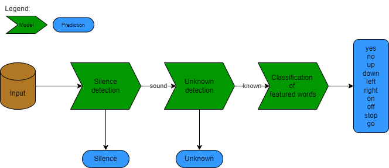

# 2024L-Deep-Learning-P2-Transformers
Project 2 for the 2024L Deep Learning course

The aim of the project is to test and compare different network architectures for audio classification task specified in [TensorFlow Speech Recognition Challenge](https://www.kaggle.com/competitions/tensorflow-speech-recognition-challenge/overview). The process of generating prediction is shown in the diagram below. For the models, we considered GRU (Gated Recurrent Unit), Bidirectional LSTM (Long Short-Term Memory) and Transformer architectures, implemented using PyTorch library in Python. 



We assume the following directory structure under root for storing data:

```{sh}
.
├── train/audio                
    ├── bed        # stores all training wav files labeled 'bed'
    ├── bird
    :
    :
    └── zero
└── test_kaggle/test/audio      # stores all test wav files
```

You should execute the notebooks in the following order:

* Preprocess.ipynb - generate datasets for training 
* Silence_detection.ipynb - silence detection task
* Unknown_detect.ipynb - unknown detection task
* Main_class_detection.ipynb - main words classification task
* Final_prediction.ipynb - combine models from 3 tasks and generate predictions for kaggle competition


  
